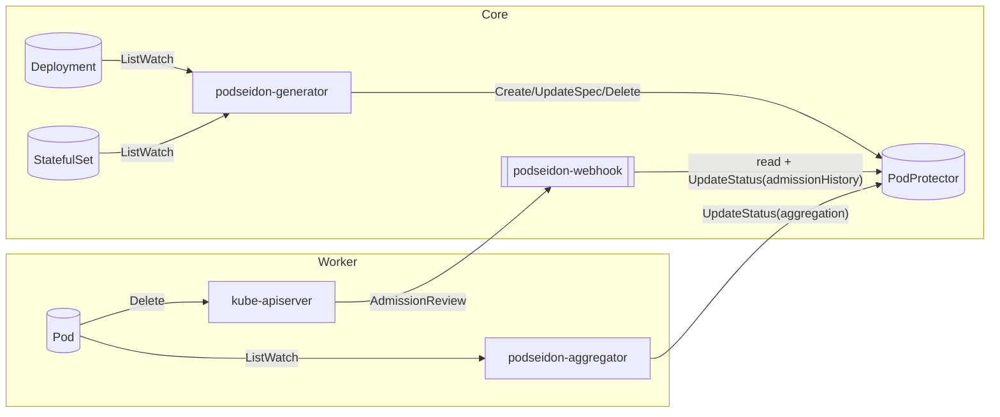

Podseidon
===

A pod deletion protection webhook with
high scalability, disaster tolerance and multi-cluster support.

## Key features

- Optional vendor-agnostic multi-cluster support
- No dependency on intermediate workload controllers
- Scalable for large clusters with high throughput
- Designed for extreme disasters such as etcd corruption

## Why?

When a user workload enters the Kubernetes control plane,
it has to go through many steps before the pods are finally processed by the kubelet &mdash;
deployment controller, replicaset controller, multi-cluster management, CD pipelines,
and probably a lot of other asynchronous controllers e.g. evictions from reschedulers,
along with the common dependencies such as kube-apiserver and etcd.
User services may be disrupted if anything goes wrong in this long chain of events.

Kubernetes is self-healing and eventually consistent &mdash;
if something fails, it will *eventually* work again.
But how long is *eventually*?
From the perspective of control plane stability,
we do not want anything to fail, even if it *will* self-heal eventually.
But due to the declarative nature of Kubernetes,
it is very easy for an accidental operation
to propagate its impact before humans can respond to it.

Podseidon provides an end-to-end safey net to minimize the risk:
if a workload request declares a requirement of *n* available pods,
the control plane can never disrupt the service beyond the minimum *n* pods.

Of course, it is impossible to prevent service disruptions
caused by the data plane itself (e.g. an entire data center caught fire)
or if Podseidon itself fails (e.g. malicious attacker deleted the entire cluster),
but Podseidon effectively reduces any single point of failure in the control plane,
especially in multi-cluster setups where Podseidon and workload control plane are deployed separately.
Check out [what scenarios](docs/coverage-analysis.md) Podseidon can prevent.

## Documentation

- [Deployment and operating procedure](docs/deployment.md)
- [Disaster coverage analysis](docs/coverage-analysis.md)
- [Technical documentation](docs/design.md)
- [Development guide](docs/development.md)

## Architecture

Since Podseidon supports multi-cluster setup,
in this diagram we express the storage of workload declarations ("core")
and management of pods ("worker") as separate clusters.
However, Podseidon can be deployed for a single cluster,
in which "core" and "worker" would be the same cluster.

See [design.md](docs/design.md) for more information.

## License

Podseidon is licensed under [Apache License 2.0](./LICENSE).
