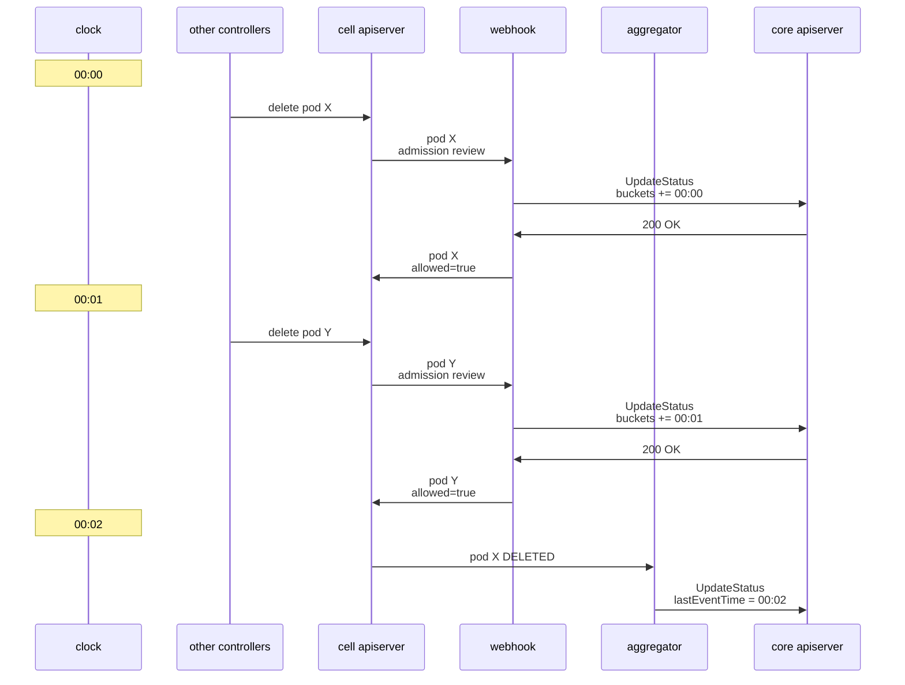
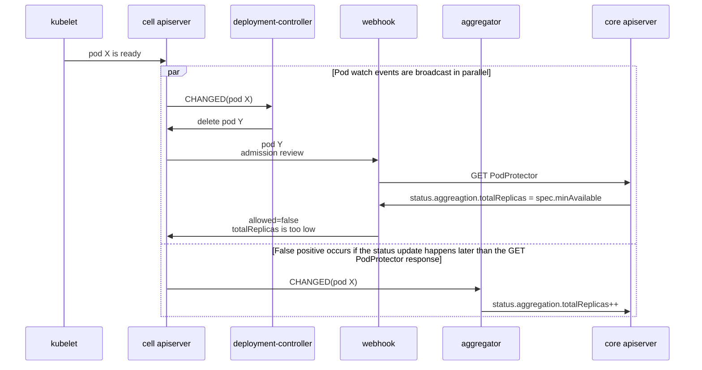

Podseidon architecture
===

This is a technical document describing the detailed mechanisms of Podseidon.

## PodProtector

The PodProtector CRD that serves the following purposes:

- Defines the availability requirement for a set of pods.
- Reflects the current availability level of the selected set.
- Records the recent deletion events related to the set of pods.

In the following discussion,
we refer to the cluster hosting all PodProtector objects as the "core" cluster.
The core cluster is required to provide strong consistency
for events involving the same PodProtector object,
but there is no consistency requirement for different PodProtector objects.
This assumption is required to prove the correct ness of webhook.

## Cell

For the sake of scalability,
Podseidon supports multi-cluster architecture.
The term "cell" refers to a partition of the global view of pods
that can be watched independently with strong consistency guarantee.
Depending on the operation details selected by the user,
a "cell" can refer to any of the following or equivalent:

- The entire cluster (for single-cluster setups)
- A member clusters in a cluster federation
- A namespace in a cluster
- A label selector among a set of mutually exclusive selectors
  that partitions all pods in a cluster

All events occurring on the pods of the same cell must be strongly consistent,
even if they are not selected by the same PodProtector object.
This assumption is required to prove the correct ness of aggregator.

## Generator

Generator is a component that interprets
different types of workloads into PodProtector objects.

When a workload object updates,
generator reconciles all PodProtectors generated from this object
(identified by the labels in the PodProtector)
and creates or updates required protections
and deletes those that are no longer required
based on the new requirements as specified by the object.
In particular, PodProtector is only deleted when
an explicit deletion timestamp is set on the source object.
If the source object simply disappeared,
generator just emits a warning metric without deleting the PodProtector.
This ensures that PodProtector continues to work
even when the source object is erased from etcd.
PodProtector has a finalizer that
only gets deleted when it is no longer required.
Other components assume the PodProtector is effective
as long as the finalizer exists,
even if it is marked for deletion by other components.
This prevents cascade deletion by other controllers
from affecting the protection.

New resource interpreter plugins can be added to generator,
which may generate multiple protector requirements for the same workload object.

## Aggregator

Aggregator is a component that writes pod status to PodProtector status.
Aggregator runs a reflector on all pods of the cell,
as well as all PodProtector objects in the core cluster.
Each pod event schedules a reconciliation for all matched PodProtectors,
and each PodProtector event schedules a reconciliation for itself,
both of which at a latency of `aggregationRate`.

The mapping from pods to matched PodProtectors
happens in the synchronous event handler of the pod informer,
which may affect apiserver list-watch SLI if the handler is too slow.
The aggregator implementation indexes PodProtectors label selectors
with a SetTrie index [(Savnik, 2012)](https://osebje.famnit.upr.si/~savnik/drafts/settrie0.pdf),
which supports querying PodProtectors in microseconds in practical scenarios.

Aggregator counts the number of available pods to the PodProtector status,
as well as the time at which this number is known to be correct.
Podseidon provides two algorithms to estimate this time,
selected with the `--aggregator-informer-synctime-algorithm` option:

- `clock`: the system time of the aggregator controller upon receiving the last informer event
- `status`: the max observed `conditions[].lastUpdateTime`/`deletionTimestamp` field in pod objects

This timestamp is to be compared with the webhook system time
during a successful admission review.
Thus, `clock` would be too late and subject to watch lag,
while `status` would be too early and may have a lower frequency of updates.
In both cases, the algorithm is also subject to clock skew from the webhook instance.

Since a reflector stream is strongly consistent,
any new pod event may be used to update
the `lastEventTime` of that cell for any PodProtector.
Aggregator internally maintains a queue called `NextEventPool`,
which buffers the list of PodProtectors that may benefit from a newer timestamp.
In test clusters and other small clusters,
`NextEventPool` may accumulate for long periods
due to lack of new pod updates to drive new events in the watch stream.
In such cases, it might be useful to manually drive pod events
by creating a dummy pod and updating it periodically,
which is available through the `--update-trigger-enable` option in aggregator.

## Webhook

Webhook is a validating admission webhook that rejects pod deletions
when the PodProtector cannot provide more unavailability quota.
Webhook checks and reserves additional unavailability quota
by performing a /status subresource UPDATE request to the core cluster,
which provides strong consistency to ensure that
only one request can succeed when trying to acquire the same quota.

When an admission review for the deletion of a ready pod is received,
the webhook computes the available disruption of each matching PodProtector:

```rs
let actual_available = 0;
let estimated_available = 0;

for cell in PodProtector.status.cells {
    actual_available += cell.aggregation.availableReplicas;
    estimated_available += cell.aggregation.availableReplicas;

    for bucket in cell.admissionHistory.buckets {
        let bucket_time = bucket.endTime.unwrap_or(bucket.startTime);
        if bucket_time > cell.aggregation.lastEventTIme {
          estimated_available -= bucket.counter.unwrap_or(1);
        }
    }
}

if actual_available <= PodProtector.spec.minAvailable {
    Quota {
        disruptable: 0,
        need_retry: 0,
    }
} else if estimated_available <= PodProtector.spec.minAvailable {
    Quota {
        disruptable: 0,
        need_retry: actual_available - PodProtector.spec.minAvailable,
    }
} else {
    Quota {
        disruptable: estimated_available - PodProtector.spec.minAvailable,
        need_retry: actual_available - estimated_available,
    }
}
```

If `disruptable` is positive, a pod may be deleted directly.
If `disruptable` and `need_retry` are both zero,
this means aggregator reports that the service is currently at minimum capacity
and further pods must not be created
until aggregator has observed more available pods.

If `disruptable` is zero but `need_retry` is positive,
this indicates the quota has been reserved by another webhook request
but has not been confirmed by the aggregator yet.
The reservation may or may not eventually be carried out,
subject to subsequent rejection from further webhooks or apiserver/etcd itself,
and this can only be confirmed by receiving the watch event in the aggregator.

## False positives and negatives

Depending on the sync time algorithm used,
false positive and negative cases are possible.

### Case 1: False negative caused by lastEventTime



In this case, aggregator uses the `clock` algorithm,
which reports `lastEventTime = 00:02`,
much later than the relevant admission time 00:00 for pod X,
thus incorrectly overwriting the admission history of pod Y.
It is impossible for aggregator to know
whether pod Y should be excluded from the current aggregation
despite its current presence in the admission history,
because the final state in this flowchart is indistinguishable
from the case where another admission webhook rejected the deletion of pod Y.

This case is particularly significant in a thundering herd condition,
where a large amount of pods are deleted between 00:00 and 00:02
but their admission history is discarded like pod Y.
To mitigate this situation,
it is advisable to limit the frequency of aggregator reconciliation
through the `aggregationRate` setting
(which can be configured both per object and globally),
such that aggregator would not instantly reconcile
and discard the immediate subsequent admission history.

### Case 2: False positive caused by aggregator latency

> [!NOTE]
> In reality, deployment-controller interacts with pods indirectly
> by scaling ReplicaSets and leaving the pod deletion work to replicaset-controller,
> but for simplicity we treat deployment-controller and replicaset-controller
> as the same component in this diagram as it does not affect the analysis result.



In this case, false positive occurs because
deployment controller deletes the pod too quickly
before the newly available pod is reflected in PodProtector.
This generally does not lead to notable issues
since replicaset-controller would just retry the pod deletion soon.
